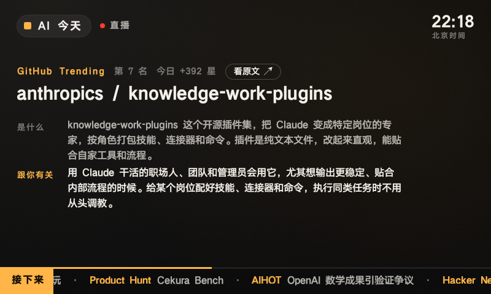

# AI 今天 · Android

原生 Android 客户端（Kotlin + 系统 View + MediaPlayer，无第三方运行时依赖），给电视盒子、触屏音箱、旧手机这类不方便用浏览器的设备。不依赖系统 WebView，所以 WebView 很老的设备也能用。



- **minSdk 21**（Android 5.0），release APK 约 85 KB
- **和网页同一条直播**：用同样的 `/api/time` 校时（7 次取往返最短）、`/api/schedule?compact=1` 节目单，每分钟刷新，到 `switchAt` 才换节目单。时间线算法是 `public/timeline.js` 的移植，单测用网页端生成的对照数据逐条比对
- **画面**：`screen/tv.js` 默认画面的原生版：台标、北京时间、角标、标题、「是什么 / 跟你有关 / AI 点评」按念到的位置依次亮起、底部「接下来」滚动条、进度条。按屏幕等比缩放，小屏有字号下限，正文放不下时自动缩字
- **打开就播**，屏幕常亮；点画面或遥控确定键 / 播放暂停键暂停或继续，方向键右（或媒体「下一首」）回到直播
- **收音机模式**：播放在前台服务里，按 Home 或熄屏继续播，通知栏和媒体键（蓝牙耳机、遥控器）可以控制；返回键或通知栏「关闭」停播
- **音频焦点**：别的 App 开始放声音就暂停；语音助手这类短暂占用只静音。有的设备（小爱触屏音箱）熄屏时会假装抢一下焦点再放掉，客户端检测到当时没有别的声音在放，就拿回焦点、追到直播接着播
- 快到条目末尾就预加载下一条；漂移超过 0.4 秒校正；音频加载失败 2 秒后重试
- 出现在手机桌面和 Android TV 启动器（带横幅）

## 构建

需要 JDK 17+（Android Studio 自带的 JBR 即可）和 Android SDK 34。SDK 路径写在 `android/local.properties`（`sdk.dir=...`）或环境变量 `ANDROID_HOME`。

```bash
cd android
./gradlew testDebugUnitTest      # 单测（时间线对照网页端、节目单校验、讲解分段）
./gradlew assembleRelease        # → app/build/outputs/apk/release/app-release.apk
```

正式签名用环境变量 `AITV_KEYSTORE`、`AITV_KEYSTORE_PASSWORD`、`AITV_KEY_ALIAS`、`AITV_KEY_PASSWORD`。没配置时 release 包用 debug 签名，可以直接安装测试。

网页端的时间线（`public/timeline.js`）改了之后，重新生成对照数据再跑单测：

```bash
node android/scripts/timeline-fixture.mjs
```

## 调试

debug 包（包名 `ai.qiaomu.aitv.debug`）每 5 秒在 logcat 打一行同步情况：

```bash
adb logcat -s AITV
# sync hn-50000488 target=10.87 pos=10.76 drift=-0.11
```

## 已验证设备

| 设备 | 系统 | 结果 |
|---|---|---|
| 小米 LX04（小爱触屏音箱，800×480） | Android 8.1 | 打开即播，和服务器时钟误差 0.1～0.2 秒，换条无缝（预加载）；熄屏继续播（约 1 秒中断，见「音频焦点」）；release 包（R8）正常 |
